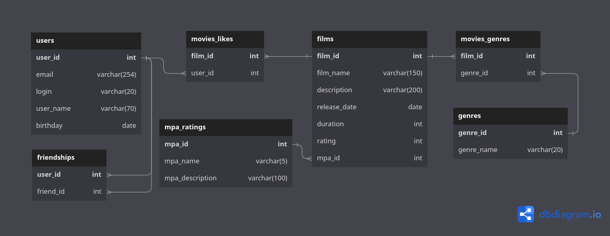

# java-filmorate

## ER-диаграмма базы данных проекта

## Описание таблиц базы данных:

### users
Содержит данные об пользователях.\
Таблица включает поля:
- первичный ключ __user_id__ - идентификатор пользователя.
- __email__ - e-mail пользователя.
- __login__ - логин пользователя.
- __name__ - имя пользователя.
- __birthday__ - дата рождения пользователя.

### friendships
Содержит информацию о друзьях пользователя.\
Таблица включает поля:
- первичный, внешний ключ __user_id__ (ссылается на таблицу __users__) - идентификатор пользователя.
- первичный, внешний ключ __friend_id__ (ссылается на таблицу __users__) - идентификатор друга.

### films
Содержит данные о фильмах.\
Таблица включает поля:
- первичный ключ __film_id__ - идентификатор фильма.
- __name__ - название фильма.
- __description__ - описание фильма.
- __release_date__ - дата выхода фильма.
- __duration__ - продолжительность фильма.
- __rating__ - рейтинг фильма.
- внешний ключ __mpa_id__ (ссылается на таблицу __mpa_ratings__) - идентификатор рейтинга MPA.

### movies_likes
Содержит информацию о том, какой пользователь поставил лайк фильму.\
Таблица включает поля:
- первичный, внешний ключ __film_id__ (ссылается на таблицу __films__) - идентификатор фильма.
- первичный, внешний ключ __user_id__ (ссылается на таблицу __users__) - идентификатор пользователя.

### mpa_ratings
Содержит данные о рейтингах MPA (Motion Picture Association).\
Таблица включает поля:
- первичный ключ __mpa_id__ - идентификатор рейтинга MPA.
- __name__ - название рейтинга.
- __description__ - описание рейтинга.

### genres
Содержит данные о существующих жанрах.\
Таблица включает поля:
- первичный ключ __genre_id__ - идентификатор жанра.
- __name__ - название жанра.

### movies_genres
Содержит информацию о том, какие жанры у фильмов.\
Таблица включает поля:
- первичный, внешний ключ __film_id__ (ссылается на таблицу __films__) - идентификатор фильма.
- первичный, внешний ключ __genre_id__ (ссылается на таблицу __genres__) - идентификатор жанра.

## Примеры SQL запросов:

### Получить информацию о пользователях старше 18 лет
SELECT *\
FROM users\
WHERE birthday <= SUBDATE(NOW(), INTERVAL 18 YEAR);

### Информация о фильмах с рейтингом NC-17
SELECT f.name\
FROM films AS f\
INNER JOIN mpa_ratings AS r ON f.mpa_id = r.mpa_id\
WHERE r.name = 'NC-17';
